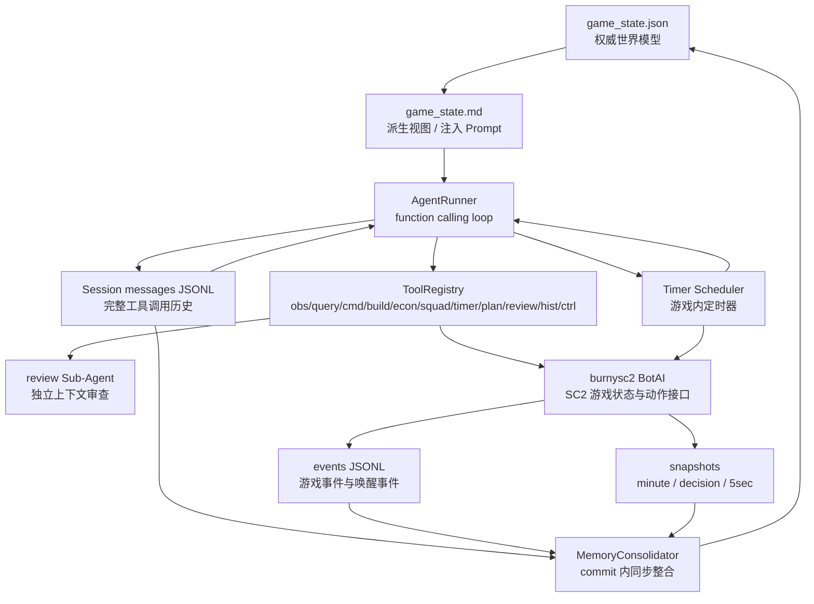
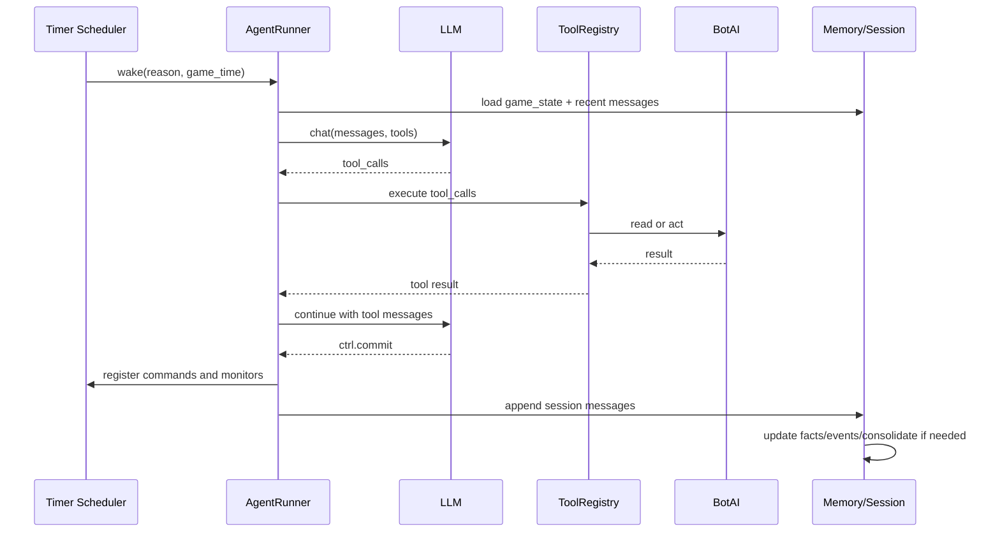
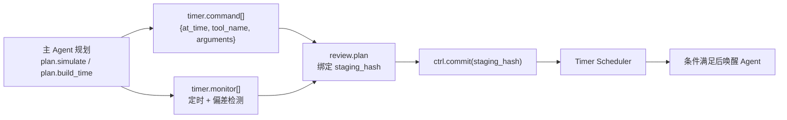

# SC2 Agent 技术设计

> 来源：合并 `详细设计文档.md` + `架构文档.md`
> 目标：覆盖架构原则、模块边界、数据模型、接口接口、运行时流程、目录结构和外部依赖。

---

## 1. 设计约定

- 文档中的 `game_time` 均为游戏内秒数。
- 所有影响游戏状态的动作必须通过工具 handler 执行。
- Agent 不直接访问 BotAI 对象，只通过工具结果了解世界。
- 所有 tool result 推荐返回 JSON 字符串，包含 `ok`、`data`、`error`、`meta`。
- 所有持久化写入采用追加或分段替换，避免改写原始历史。
- 系统采用 stop-the-world：`PAUSED_THINKING` 下游戏暂停并允许 LLM/工具/Sub-Agent 运行；`RUNNING_SLEEP` 下游戏运行并只允许 Timer Scheduler 推进。
- `ctrl.commit(staging_hash)` 是 `PAUSED_THINKING -> RUNNING_SLEEP` 的唯一出口，`timer.monitor` 触发是 `RUNNING_SLEEP -> PAUSED_THINKING` 的唯一入口。

## 2. 架构原则

- **单 Agent 主导**：不再使用 Strategy、Phase、Executor、Supervisor 的强制流水线。
- **Stop-the-world**：Agent 思考期间游戏暂停，Agent sleep 后游戏运行，timer/monitor 触发后再次暂停。
- **工具即能力边界**：所有观察、推理辅助和动作都通过 function calling 工具完成。
- **记忆持续演化**：`game_state.json` 是长期世界模型权威源，`game_state.md` 是派生视图，JSONL 与快照是可回溯事实层。
- **时间线驱动执行**：Agent 提交带时间戳的命令，由 Timer Scheduler 在游戏循环中接管。

## 3. 总体架构



### 3.1 决策周期时序



### 3.2 时间线执行流程



## 4. 核心数据模型

### 4.1 ToolSpec 与 ToolResult

```python
class ToolSpec(BaseModel):
    name: str                    # namespace.action
    description: str
    parameters: dict             # JSON Schema
    read_only: bool = False
    timeout_ms: int = 1000
    handler: str                 # handler 注册名

class ToolResult(BaseModel):
    ok: bool
    data: dict | list | str | None = None
    error: str | None = None
    code: str | None = None
    meta: dict = {}
```

约定：成功返回 `{"ok": true, "data": ...}`，失败返回 `{"ok": false, "code": "...", "error": "...", "meta": {...}}`。handler 捕获异常并转换为失败结果，不直接抛给 AgentRunner。

### 4.2 TimerCommand

```python
class TimerCommand(BaseModel):
    id: str
    at_time: float
    tool_name: str
    arguments: dict
    reason: str | None = None
    created_at: float
    wake_id: int
    status: Literal["pending", "done", "failed", "cancelled"] = "pending"
```

不支持 `call="build.train(...)"` 字符串执行形式。字符串只能从结构化字段派生用于日志展示。

### 4.3 TimerMonitor

```python
class TimerMonitor(BaseModel):
    id: str
    metric: Literal[
        "game_time", "minerals", "gas", "supply_available",
        "unit_count", "enemy_count", "building_progress",
        "unit_distance", "unit_in_region",
    ]
    op: Literal[">", ">=", "<", "<=", "==", "!="]
    value: float | int | bool
    reason: str
    before_time: float | None = None
    unit_type: str | None = None
    building_type: str | None = None
    unit_tag: int | None = None
    target_x: float | None = None
    target_y: float | None = None
    region: tuple[float, float, float, float] | None = None
    created_at: float
    wake_id: int
    active: bool = True
```

### 4.4 SessionState 与 GameState

```python
class SessionState(BaseModel):
    session_id: str
    messages_path: Path
    last_consolidated: int = 0
    wake_id: int = 0
```

`last_consolidated` 首版使用消息序号。裁剪历史采用 nanobot `_find_legal_start()` 规则：窗口切在 tool-call group 中间时，丢弃 orphan tool result。

```python
class GameState(BaseModel):
    wake_id: int
    game_time: float
    strategic_judgement: Section
    current_priorities: Section
    known_facts: Section
    key_events: Section

class Section(BaseModel):
    updated_at: float
    content: list[str]
```

`game_state.json` 是权威源，代码和 MemoryConsolidator 只写 JSON；`game_state.md` 是从 JSON 生成的派生视图，用于注入 System Prompt。固定四段模板：

```markdown
# 当前局势 (wake #{wake_id}, {game_time}s)
## 战略判断 (updated at {game_time}s)
## 当前优先级 (updated at {game_time}s)
## 已知事实 (updated at {game_time}s)
## 关键事件 (updated at {game_time}s)
```

### 4.5 快照模型

```python
class SnapshotMeta(BaseModel):
    kind: Literal["minute", "decision", "5sec"]
    game_time: float
    wake_id: int | None
    path: Path
```

## 5. 核心模块

### 5.1 AgentRunner

职责：构建本轮 messages（system + history + user wake reason），调用 LLM，执行 tool calls，在 `ctrl.commit()` 或 `ctrl.abort()` 后结束，将完整周期 messages 交给 Session 持久化。

输入：

```python
class AgentRunSpec(BaseModel):
    wake_id: int
    game_time: float
    reason: str
    system_prompt: str
    history_messages: list[dict]
    tools: list[ToolSpec]
    max_iterations: int = 20
```

关键规则：
- assistant 的 tool_calls 必须作为 assistant message 保存，tool result 必须关联 `tool_call_id`。
- 不把工具结果拼接进 user message。
- 读工具可并发执行；写工具按 LLM 返回顺序串行执行。
- `ctrl.commit` 之前的 timer 变更进入暂存区，commit 后才注册到 Scheduler。
- `ctrl.commit` 必须是最后一轮唯一 tool_call，且必须携带通过 `review.plan` 审查的 `staging_hash`。
- 达到 max_iterations 未提交时，默认 abort 并记录。

### 5.2 ToolRegistry

管理所有工具定义和 handler。工具按命名空间划分：

| 命名空间 | 职责 |
|----------|------|
| `obs.*` | 读取当前游戏状态 |
| `query.*` | 按条件搜索实体 |
| `cmd.*` | 对单位下达 burnysc2 原生命令 |
| `build.*` | 建造、训练、研发、挂件 |
| `econ.*` | 采集、转移工人、扩张、气矿 |
| `squad.*` | 小队管理与批量控制 |
| `timer.*` | 定时命令、条件唤醒、timer 管理 |
| `plan.*` | 资源曲线、建造耗时、开局模板 |
| `review.*` | 参数审查和逻辑审查 |
| `hist.*` | 历史快照、事件和趋势查询 |
| `ctrl.*` | commit、abort、工具发现、skill 加载 |

工具 schema 由 function calling 暴露给模型，System Prompt 只保留命名空间摘要。

### 5.3 工具命名空间细化

#### obs (12 个)

`obs.resources` / `obs.units` / `obs.unit` / `obs.structures` / `obs.enemy_visible` / `obs.enemy_inferred` / `obs.map` / `obs.bases` / `obs.upgrades` / `obs.game_time` / `obs.controller` / `obs.scores`

#### query (13 个)

`query.find_units` / `query.find_enemy` / `query.find_structures` / `query.find_workers` / `query.find_idle` / `query.idle_producers` / `query.in_region` / `query.closest` / `query.placements` / `query.expansions` / `query.path` / `query.can_afford` / `query.tech_requirement`

#### cmd (18 个)

`cmd.move` / `cmd.attack_target` / `cmd.attack_move` / `cmd.stop` / `cmd.hold` / `cmd.patrol` / `cmd.use_ability` / `cmd.load` / `cmd.unload` / `cmd.siege` / `cmd.unsiege` / `cmd.cloak` / `cmd.decloak` / `cmd.morph` / `cmd.repair` / `cmd.return_cargo` / `cmd.cancel_order` / `cmd.smart`

#### build (9 个)

`build.structure` / `build.cancel` / `build.land` / `build.lift` / `build.addon` / `build.train` / `build.cancel_train` / `build.research` / `build.cancel_research`

#### timer / review

`timer.command` / `timer.monitor` / `timer.list` / `timer.cancel`
`review.plan` / `review.params` / `review.logic`

### 5.4 工具错误码

| 错误码 | 含义 |
|--------|------|
| `INVALID_ARGUMENT` | 参数不符合 schema 或业务约束 |
| `TAG_NOT_FOUND` | unit_tag 或 structure_tag 不存在 |
| `NOT_READY` | 生产建筑未完成或单位不可执行 |
| `CANNOT_AFFORD` | 当前或预测资源不足 |
| `TECH_MISSING` | 科技前置不满足 |
| `INVALID_POSITION` | 坐标或建筑位置非法 |
| `ORDER_CONFLICT` | 同一单位同一时间存在冲突命令 |
| `TOOL_TIMEOUT` | handler 超时 |
| `INTERNAL_ERROR` | 未分类异常 |

### 5.5 Timer Scheduler

只在 `RUNNING_SLEEP` 状态运行。每帧检查到期命令并调用对应工具 handler，每帧评估 monitor 条件，条件满足时唤醒 Agent 附带 reason，`before_time` 到期后注销对应 monitor。

metric 计算：`game_time`→`bot.time`、`minerals`→`bot.minerals`、`gas`→`bot.vespene`、`supply_available`→`bot.supply_cap - bot.supply_used`、`unit_count`→按类型统计、`enemy_count`→敌方可见单位数、`building_progress`→按建筑类型或 tag 获取、`unit_distance`→单位到目标点距离、`unit_in_region`→单位是否在矩形区域内。

### 5.6 MemoryStore 与 Session

MemoryStore 管理 `game_state.json` 权威源和 `game_state.md` 派生视图。四段中：战略判断和当前优先级由整合 LLM 维护，已知事实和关键事件由代码维护。每段都有更新时间。

Session 是完整消息账本：每次 wake-up 周期的 messages 追加写入 JSONL，原始消息永不删除，`last_consolidated` 标记已整合位置，`get_history()` 只返回游标之后的近期 raw messages。

### 5.7 MemoryConsolidator

stop-the-world 模型下 commit 后、sleep 前同步执行。每次 commit 后执行代码更新（事实和事件）；当 `get_history()` token 超预算时调用便宜 LLM 更新战略判断和当前优先级；整合完成后推进 `last_consolidated` 并重新生成 `game_state.md`。不修改原始 messages。

触发条件：`estimate_tokens(session.get_history()) > config.history_token_budget`（建议首版 12000 tokens）。整合批次按 wake-up 周期边界取最早若干周期，`game_state.md` 目标长度 1000-2000 tokens。

### 5.8 Sub-Agent

用于 `review.logic`（审查战术/资源/战略/时间线）、差异分析（对比观测与历史快照）、monitor 校准（调整条件阈值）。Sub-Agent 是工具 handler 内部同步 spawn 的一次性 AgentRunner，messages、工具集和迭代上限都与主 Agent 隔离。

### 5.9 RoundRecorder 与 SnapshotRecorder

事件日志：记录 wake-up、tool call、timer 触发、命令执行、关键游戏事件。三层快照：分钟级（每 60s，无上限）、决策级（每次 commit，保留最近 5 份）、秒级（每 5s，保留最近 5 份）。

### 5.10 PromptBuilder

四段式 System Prompt：身份与运行时约束 + 当前局势（`game_state.md` 原样注入）+ 可用工具（只列命名空间摘要）+ 可用技能（always skill 自动注入，其他通过 `skill.load` 加载）。

### 5.11 SkillLoader

Skill 文件格式：YAML frontmatter + Markdown 正文。`always: true` 的 skill 自动注入，非 always skill 通过 `skill.load(name)` 按需加载。workspace `skills/{name}/SKILL.md` 优先于 builtin skills，同名 workspace skill 覆盖 builtin。

## 6. 数据流

### 6.1 观测数据流

```
burnysc2 BotAI → obs.* 工具 → tool message → Agent 推理
→ commit 后由代码抽取已知事实 → game_state.json → game_state.md 派生视图
```

### 6.2 动作数据流

```
Agent 推理 → timer.command(at_time, tool_name, arguments)
→ review.plan(staging_hash) → ctrl.commit(staging_hash)
→ Timer Scheduler → 到期执行 cmd/build/econ/squad 工具
→ burnysc2 BotAI → 事件日志
```

### 6.3 记忆数据流

```
本轮 messages → Session JSONL append → get_history token 评估
→ 超预算时整合旧消息 → 更新 game_state.json → 生成 game_state.md
→ last_consolidated 前移
```

### 6.4 唤醒上下文

```
system:  身份与运行时约束 + game_state.md + 工具命名空间摘要 + skill 摘要
history: last_consolidated 之后的近期 raw messages
user:    game_time + wake reason + 触发 monitor 的上下文
```

## 7. 模块边界

| 模块 | 可以依赖 | 不应依赖 |
|------|----------|----------|
| AgentRunner | LLM provider、ToolRegistry、Session、PromptBuilder | burnysc2 具体动作实现 |
| ToolRegistry | 工具定义、handler 工厂 | Prompt 拼接逻辑 |
| 工具 Handler | BotAI、Managers、Storage | LLM 主循环 |
| Timer Scheduler | TimerStore、ToolRegistry、BotAI 时间 | MemoryConsolidator、LLM provider |
| MemoryConsolidator | Session、MemoryStore、events、LLM provider | Timer Scheduler 内部队列；只在 commit 同步阶段运行 |
| Sub-Agent Manager | AgentRunner、最小 ToolRegistry | 主 Agent messages 引用 |
| PromptBuilder | MemoryStore、SkillLoader、Tool summary | 工具 handler 执行 |

## 8. 建议目录结构

```
sc2_agent/
  __init__.py
  main.py

  runtime/
    state.py              # stop-the-world 状态机
    controller.py         # Agent 唤醒、暂停/恢复游戏
    context.py            # 单局运行上下文

  agent/
    runner.py             # function calling loop
    prompt_builder.py     # system prompt 构建
    session.py            # JSONL messages + last_consolidated
    subagent.py           # review / diff / monitor-calibration
    hooks.py              # 生命周期钩子

  tools/
    base.py / registry.py / obs.py / query.py / cmd.py
    build.py / econ.py / squad.py / timer.py / plan.py
    review.py / hist.py / ctrl.py

  timer/
    models.py / staging.py / store.py / scheduler.py

  planning/
    simulator.py / costs.py / build_orders.py / tech_tree.py

  memory/
    models.py / store.py / renderer.py / consolidator.py
    extractor.py / recorder.py / snapshots.py

  llm/
    provider.py / router.py / models.py

  managers/
    production.py / squad.py / tactic.py / resources.py

  observation/
    collector.py / enemy_tracker.py / map_state.py

  skills/
    loader.py / main-flow/SKILL.md / production-math/SKILL.md
    timeline-planning/SKILL.md / standard-openings/SKILL.md
    review-knowledge/SKILL.md / review-dimensions/SKILL.md
    consolidation-guide/SKILL.md / monitor-calibration/SKILL.md

  storage/               # 运行产物，按对局 ID 分目录
    sessions/ / events/ / snapshots/{minute,decision,recent_5sec}/
    memory/{game_state.json,game_state.md} / timers/

  config/
    settings.py          # pydantic-settings
    defaults.yaml

  logging/
    logger.py            # loguru 初始化
    decision_logger.py   # 兼容/迁移现有 DecisionLogger
```

分层原则：
- `agent/` 只负责 LLM 循环和上下文，不直接依赖 burnysc2。
- `tools/` 是 Agent 访问游戏和系统能力的唯一入口。
- `runtime/` 固化 stop-the-world 状态转换。
- `timer/` 只执行已提交的结构化 timer，不解析字符串命令。
- `planning/` 放确定性模拟和 SC2 领域表。
- `memory/` 以 `game_state.json` 为权威源，`game_state.md` 只由 renderer 派生。

## 9. 外部依赖

### 建议引入

| 依赖 | 用途 |
|------|------|
| `openai>=2.8` | OpenAI-compatible function calling SDK |
| `pydantic>=2.12` | 工具参数、配置和数据模型 |
| `pydantic-settings>=2.12` | 环境变量配置 |
| `loguru>=0.7` | 结构化日志 |
| `tiktoken>=0.12` | token 计数 |
| `json-repair>=0.57` | 修复 LLM JSON 输出 |
| `msgpack>=1.1` | 快照和事件高效序列化 |

### 不建议引入

不需要 CLI/TUI、聊天网关、WebSocket、自定义搜索、cron、MCP 等 nanobot 周边依赖。SC2 的 timer 使用游戏内时间，不需要系统 cron。

## 10. 兼容与迁移

**保留组件**：LLMClient 路由/重试逻辑（收缩为薄路由层）、ProductionManager / SquadManager / TacticManager、observation 模块、DecisionLogger、strategy_pool.py（转为 `plan.build_order` 和 `game_state.json` 初始化数据源）。

**移除组件**：StrategyLayer、PhaseLayer、ExecutionLayer、Supervisor、旧 prompt 文件、旧 TriggerScheduler、全量观测 dump 注入逻辑。

## 11. 架构风险

| 风险 | 影响 | 缓解 |
|------|------|------|
| 工具数量多，schema 维护复杂 | handler 分散、测试压力上升 | 命名空间拆分、统一 Tool 基类、自动 schema 校验 |
| timer.command 结构化参数执行错误 | 定时命令失败 | 工具 schema 校验 + `review.params` 检查 |
| monitor 条件过敏 | 高频唤醒浪费 LLM | 高频自查、before_time、校准 subAgent |
| game_state.json / game_state.md 不一致 | 决策基于旧战略 | JSON 为权威源，Markdown 每次 commit 重新派生 |
| review Sub-Agent 成本高 | 延迟增加 | `review.params` 先跑，逻辑审查最小工具集、限制 max_iterations |
| MemoryConsolidator 误总结 | 战略偏差 | 原始 JSONL 永不删除，hist.* 可回查，事实段由代码维护 |

## 12. 已决策与开放问题

### 已决策

- `timer.command` 只使用结构化 `{at_time, tool_name, arguments}`，不兼容执行字符串。
- MemoryConsolidator 在 stop-the-world 模型下同步执行：commit 后、sleep 前跑完。
- `game_state.json` 是权威源，`game_state.md` 是派生视图。
- `review.plan` 与 `ctrl.commit` 通过 `staging_hash` 绑定。

### 开放问题

- `last_consolidated` 使用消息序号、JSONL 行号还是 byte offset。
- 快照首版使用 JSON 方便调试，还是直接使用 msgpack。
- review Sub-Agent 是否每次提交强制运行，还是只在 `review.params` 通过且命令数超过阈值时运行。

## 13. 日志系统

### 13.1 定位

日志系统记录系统技术行为，与记忆系统互补：

| | 日志系统 | 记忆系统 |
|----|----------|----------|
| 记录对象 | 系统技术行为 | Agent 对世界的认知 |
| 读者 | 开发者 | Agent（注入 prompt） |
| 存储 | `storage/{game_id}/logs/` | `storage/{game_id}/memory/` |

### 13.2 技术选型

使用 **loguru** 替代标准库 logging。依赖 `loguru>=0.7`。

### 13.3 日志层级

| 层级 | 用途 |
|------|------|
| TRACE | 工具参数/返回值 dump |
| DEBUG | 内部状态变化（状态机转换、staging 更新） |
| INFO | 关键生命周期事件（wake-up、commit、LLM 调用完成） |
| WARNING | 可恢复异常（工具返回 ok:false、LLM 重试） |
| ERROR | 不可恢复但系统继续（LLM 调用失败、commit 失败） |
| CRITICAL | 系统崩溃 |

### 13.4 Sink 设计

每局一个 `storage/{game_id}/logs/` 目录，三条流：

- `app.log` — JSON 行格式，DEBUG+，50MB rotation，30 天 retention
- `errors.log` — ERROR+ 独立流，90 天 retention
- stderr — 可读彩色格式，`INFO+`（可配）

利用 loguru `bind()` 自动注入 game_time、wake_id 等结构化字段。

### 13.5 事件类型标识

| event | 来源 |
|-------|------|
| `bot.start` | Bot 启动 |
| `agent.wake` / `agent.commit` / `agent.abort` / `agent.sleep` | Agent 周期 |
| `llm.request` / `llm.response` / `llm.failed` | LLM 调用 |
| `tool.executing` / `tool.result` / `tool.failed` | 工具执行 |
| `state.transition` | 状态机切换 |
| `timer.command.executed` / `timer.monitor.triggered` / `timer.monitor.expired` | Timer |
| `game.state` | 游戏关键数据快照 |
| `memory.consolidation` | 记忆整合 |

### 13.6 HTML 可视化（后续实现）

单文件 HTML 仪表盘，三个面板：时间线总览（wake 周期 + LLM 调用 + 工具调用）、资源曲线（minerals/vespene/supply 折线图）、可过滤事件列表。JSON 行格式天然支持，无需修改日志格式。
